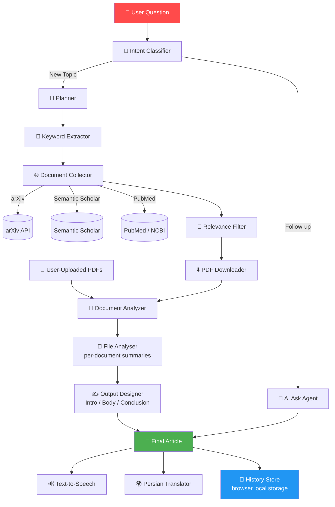
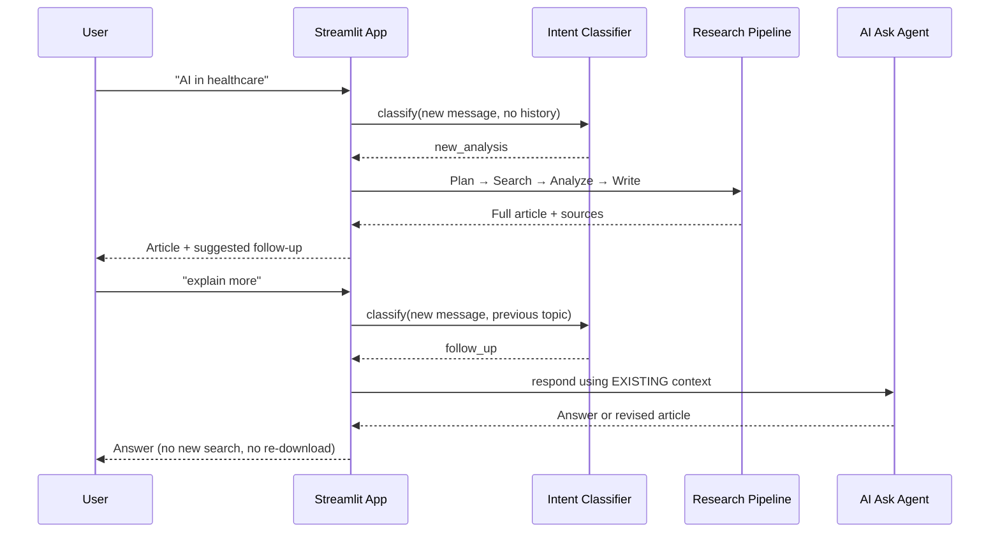

<div align="center">

# 🤖 AI Agent Deep Search

### A multi-agent research assistant that turns one question into a fully-written, source-backed research article — powered entirely by local LLMs.


-4CAF50?style=for-the-badge)


</div>


## 💡 Why This Exists

Reading, filtering, and synthesizing academic papers is slow. **AI Agent Deep Search** automates the whole pipeline — from *"what should I read?"* to *"here's a fully-written article, with sources, that answers your question."*

It's built as a small **society of specialized agents** rather than one giant prompt: each agent does exactly one job well, hands its output to the next, and the whole thing is orchestrated by a Streamlit chat interface that feels like talking to a research partner — not filling out a form.

---

## ✨ What It Does

Given a single question (in **any language**), the system will:

1. 🧭 **Route** the topic to the best academic source (arXiv for CS/AI/Math, PubMed for medicine, Semantic Scholar for everything else)
2. 🔑 **Translate & extract** clean English search keywords
3. 🌐 **Search, filter, and download** real, verified PDFs (not broken HTML redirects)
4. 📄 **Analyze** every document — yours and the ones it found — chapter by chapter
5. ✍️ **Write** a complete article: Introduction → Body → Conclusion → References
6. 💬 **Keep talking** — ask it to go deeper, simplify, or challenge a follow-up like a real conversation
7. 🔊 **Read it aloud**, or 🌍 **translate it to Persian**, fully offline, on demand

All of this is saved to a **persistent history** that survives page refreshes.

---

## 🏗️ Architecture



---

## 🔄 How a Request Flows Through the System

The system doesn't blindly restart research on every message — it first decides whether you're **continuing** a conversation or **starting** a new one:



This routing is why a two-word reply like *"explain more"* doesn't trigger a brand-new, expensive research cycle.

---

## 🧩 Tech Stack

| Layer | Technology |
|---|---|
| **UI / Frontend** | [Streamlit](https://streamlit.io/) — custom CSS + injected JS for a fixed chat bar, floating panels, and auto-scroll |
| **LLM Runtime** | [Ollama](https://ollama.com/), fully local (`llama3.2`, `qwen2.5`, etc.) via the OpenAI-compatible SDK |
| **Academic Search** | arXiv API · Semantic Scholar Graph API · PubMed (NCBI E-utilities) |
| **PDF Parsing** | `pypdf` |
| **Translation (EN → FA)** | [Argos Translate](https://www.argosopentech.com/) — 100% offline, no API calls |
| **Text-to-Speech** | `gTTS` |
| **Markdown / RTL Rendering** | `markdown` + custom right-to-left CSS |
| **Persistence** | `streamlit-local-storage` — chat history lives in the browser |
| **Config** | `python-dotenv` |

---

## 📊 Project Stats

| Metric | Value |
|---|---|
| 🗓️ Development time | 9 days |
| 🧵 Lines of code | **2,400+** (Python + CSS) |
| 🤖 Specialized agents | **11** |
| 🔁 Local test/debug runs | **1,700+** |
| 🌐 Academic sources integrated | 3 (arXiv, Semantic Scholar, PubMed) |
| 🗣️ Languages supported (input) | Any — auto-translated to English for search |

---

## 📁 Project Structure

```
ai-agent-deep-search/
├── app.py                        # Streamlit UI orchestration & pipeline wiring
├── config.py                     # Effort-level settings (Low / Medium / High)
├── session_state_init.py         # Centralized Streamlit session-state defaults
│
├── agents/
│   ├── Planner.py                 # Chooses the best paper source for the topic
│   ├── key_word.py                 # Extracts English keywords + filters for relevance
│   ├── Document_collector.py       # Searches & downloads verified PDFs
│   ├── User_docs.py                # Extracts text from PDFs, runs per-doc analysis
│   ├── File_analyser.py            # Summarizes documents
│   ├── Output_design.py            # Writes the final article (Intro/Body/Conclusion)
│   ├── text_input.py               # Classifies: new topic vs. follow-up
│   ├── AI_ask.py                    # Answers follow-ups using existing context
│   ├── translator.py               # Offline EN → FA translation (Argos)
│   ├── history_store.py            # Reads/writes chat history to local storage
│   └── upload_manager.py           # Handles user PDF uploads (dedupe, limits, cleanup)
│
├── ui/
│   └── components.py               # Chat bubbles, scroll button, RTL renderer
│
└── static/
    └── style.css                   # Fixed chat bar, floating panels, custom buttons
```

---

## 🚀 Getting Started

### 1. Prerequisites
- Python 3.12+
- [Ollama](https://ollama.com/) running locally with at least one model pulled:
  ```bash
  ollama pull llama3.2
  ```

### 2. Install dependencies
```bash
pip install streamlit streamlit-option-menu streamlit-local-storage openai requests python-dotenv pypdf gTTS markdown argostranslate
```

### 3. Run it
```bash
streamlit run app.py
```

---

## ⚙️ Configuration

Create a `.env` file in the project root:

```env
SEMANTIC_SCHOLAR_API_KEY=your_key_here
```

Get a free key at [semanticscholar.org/product/api](https://www.semanticscholar.org/product/api). If it's missing, expired, or rate-limited, the app **automatically falls back to arXiv** — no crash, no manual intervention.

---

## 🎛️ Feature Highlights

- ⚡ **Effort levels** — Low / Medium / High control how deep and long each analysis goes
- 🌐 **Web search toggle** — restrict the agent to only your uploaded PDFs if you prefer
- 📎 **Multi-file upload** — up to 5 PDFs, auto-deduplicated by filename
- 🧠 **Context-aware follow-ups** — the intent classifier tells "explain more" apart from "new topic," so it never re-downloads papers unnecessarily
- 🗂️ **Persistent history sidebar** — revisit or delete past conversations, stored client-side
- 🔊 **Listen** to any result · 🌍 **Translate** it to Persian with proper RTL typography
- 🛡️ **Resilient by design** — PDF-link validation, redirect handling, and automatic source fallback keep the pipeline from breaking on bad data

---

## 🗺️ Roadmap

- [ ] Chart/visualization generation for quantitative findings
- [ ] Multi-user support with server-side persistence
- [ ] Support for more academic databases (CORE, CrossRef)
- [ ] Export to PDF / Word

---

<div align="center">

Built solo, end-to-end — from the first `st.text_input` to a full multi-agent research pipeline.

⭐ If this project is useful to you, consider giving it a star!

</div>
